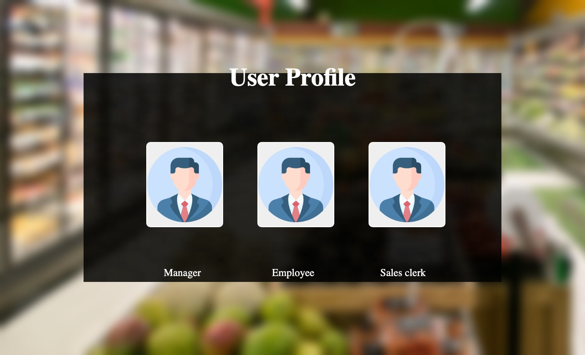
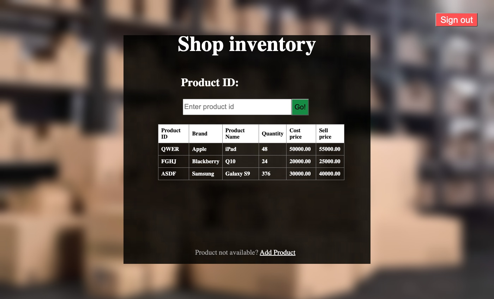
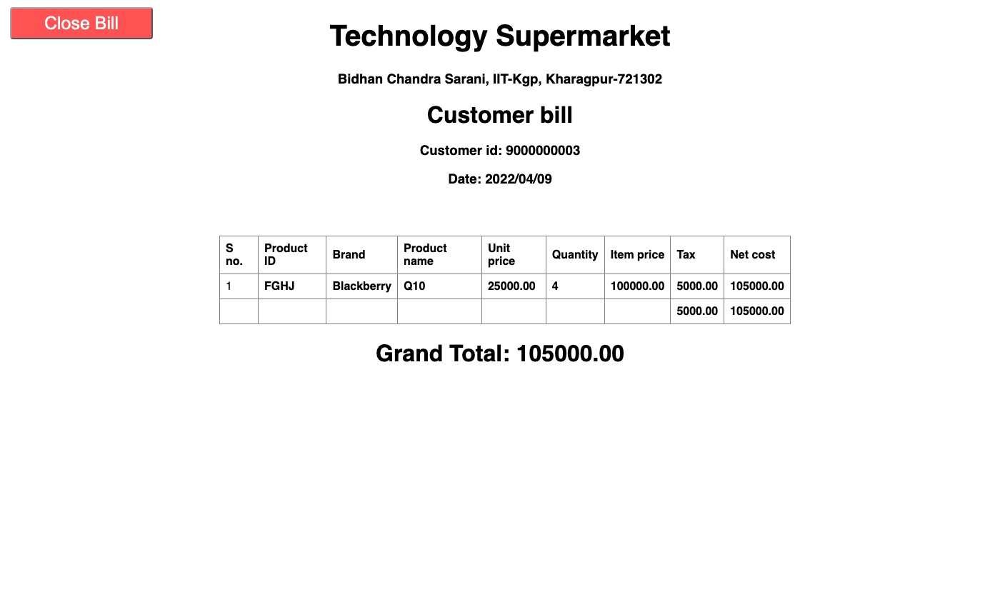
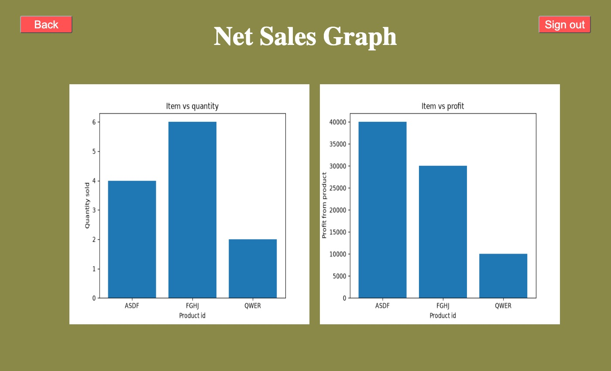

# Supermarket Automation Software (SAS)

A Django web application for running a supermarket's day-to-day operations. It has three roles, each with its own login and screens:

| Role | What they can do |
|---|---|
| **Sales clerk** | Start a bill for a customer, add items by product ID, and print the final bill with 5% tax. Stock is checked and decremented automatically. |
| **Employee** | View the inventory, add new products, and record stock arrivals. |
| **Manager** | Everything an employee can do, plus change selling prices and view **sales statistics**: quantity sold and profit per product over a date range, as charts. |

It was built for the Software Engineering Laboratory at IIT Kharagpur (Spring 2022). It comes with a full set of SE documents: requirements specification, test plan, test suite, compliance report and UI wireframes.

| Home | Inventory |
|---|---|
|  |  |
| **Customer bill** | **Sales statistics** |
|  |  |

## Getting started

Requires Python 3.10+.

```bash
pip install -r requirements.txt
cd mySite
python manage.py migrate                    # creates the database and the three roles
python manage.py loaddata sample_products   # optional: three sample products
python manage.py createsuperuser            # an admin who can open every screen
python manage.py runserver
```

Then open <http://127.0.0.1:8000/>. Pick a role on the home page, then sign up or log in. Signing up through a role's page gives the new account that role.

The admin site at `/admin/` lets a superuser manage products, transactions, users and roles directly.

## Design

- **Models** ([`superMarket/models.py`](mySite/superMarket/models.py)):
  - `product`: ID, brand, name, cost and selling price, stock quantity, sold by quantity or by weight
  - `transaction`: one per bill, with date, customer number, total, tax and profit
  - `sold_product`: one line of a bill, linked to its product and transaction
- **Roles** are Django auth groups (`Managers`, `Employees`, `SalesClerk`), created by a migration. The `allowed_users` decorator checks them on every page; superusers can open everything.
- **Billing** keeps the bill a clerk is working on in their own session. Several clerks can bill at the same time, and the database assigns all IDs.
- **Statistics** are drawn with Matplotlib for sales between two dates, both days included, and served as static images.

## Tests

```bash
cd mySite
python manage.py test superMarket
```

22 tests cover:
- role sign-up and access control
- a complete bill (totals, tax, profit and stock)
- separate and concurrent bills, stock limits and invalid input
- inventory and price updates
- the sales statistics pages
- date parsing

## Repository layout

```
mySite/
  mySite/          Django project settings and URLs
  superMarket/     the app: models, views, role decorators, forms, migrations, fixtures, tests
  templates/       HTML pages for each screen
  static/          images and backgrounds (statistics charts are generated here)
docs/
  SRS.pdf                 software requirements specification
  test-plan.pdf           test planning document
  test-suite.pdf          test cases
  compliance-report.pdf   compliance report
  ui-wireframes.pdf       hand-drawn UI wireframes
  screenshots/
```

For anything beyond local use, set the `DJANGO_SECRET_KEY` environment variable and turn off `DEBUG` in `mySite/settings.py`.

## Team (Group 18)

- **Devendra Palod** (20CS10024)
- **Subhajyoti Halder** (20CS10064)
- **Deepiha S** (20CS30015)

Software Engineering Laboratory, Department of Computer Science and Engineering, IIT Kharagpur, Spring 2022.
